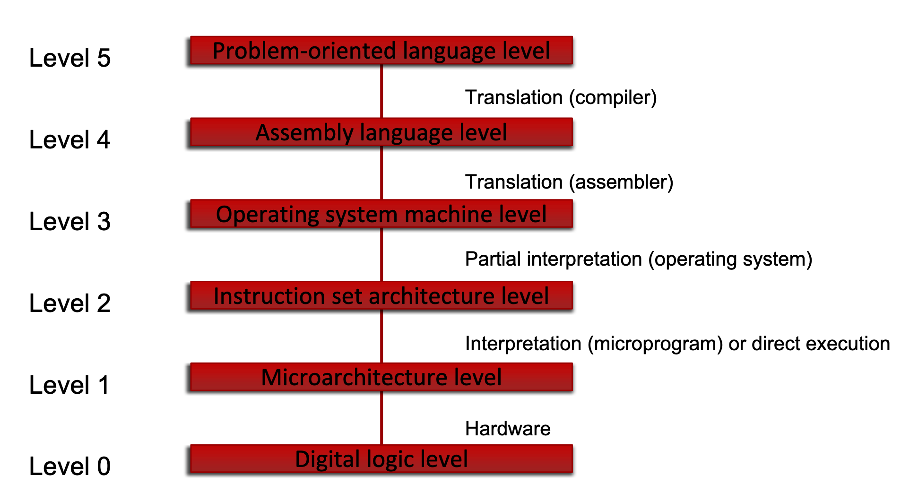
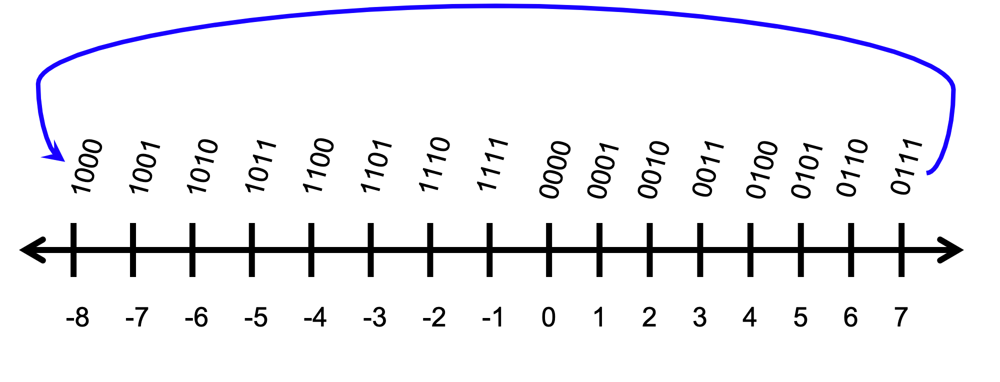

# 8/20/19: Course Intro & Datatypes
- [8/20/19: Course Intro & Datatypes](#82019-course-intro--datatypes)
    - [Abstractions](#abstractions)
    - [Binary](#binary)
    - [Computers store unsigned whole numbers](#computers-store-unsigned-whole-numbers)
- [Datatypes](#datatypes)

<!-- tocstop -->
- timed labs: very similar to hw, review hw when studying for timed labs
- Turing equivalence: all computers can compute same types of things
## Abstractions

- 0: circuits/devices
- 1: microarchitecture
- 2: machine architecture

## Binary
- binary is best for computing vs decimal
    - easier to determine presence/absence of current versus magnitude of electricity
    - can use lower voltages (0/1 versus 0-9)
## Computers store unsigned whole numbers
- computers can't "store" a number - its an abstraction/idea
- everything in computer is a finite-sized representation of something
- bunch of binary digits (bits) interpretable as unsigned whole number

# Datatypes
---
- computer store patterns of switches that are set on/off
    - we choose representations of real-world things that are easy to work with
- a set of values from which a variable can take its value. A type is a classification of data that tells the compiler how programmer intends to use it
- **Bit**: binary digit

trick: 2^10 ~1000, so 
ex) 2^24 = 2^10 * 2^10 * 2^4 ~ 16,000,000

- potential problem: negative numbers
- possible apporach: use one bit to represent the sign of the number
    - !!! note __signed magnitude__
        - range is -2^n-1^ to 2^n-1^
        - problem: not good with hardware, have +0 and -0
- solution: use a number line and modular arithmetic
    - !!! note 2's complement - used in all computers today, and don't need to worry about subtraction (bitwise inverse - reverse the bits and add)
        - range is -2^n-1^ to 2^n-1^ - 1

- how to negate number with 2's complement
    - **flip bits and add 1**
    -       ex) 5 = 0101
    -          -5 = 1010
    -             + 0001
    -             = 1011
- Overflow Rule
    - check carry in and carry out of leading digit (if there is a carry in the sign bit, or if there is a carry that is outside of the sign bit)
    - problem only happens when adding 2 positive #s or 2 negative #s
        - if this happens, just dump the extra carry out bit
    - when adding positive and negative, ignore the "extra" bit

- Sign Extension
    - ex) adding 4 bit number to 8 bit number
        - extend the sign number to the left
        -     ex) -2 + 64
        -     -2 = 1110 sign is 1, so extend 1 to the left
        -     -2 in 64 bit:  11111110
        -     64 in 64 bit:+ 01000000
        -                   100111110
- A + A is the same as 2 * A which is just shifting the bits to the left 1 (A << 1)

- fractional binary number
    - place value of nth bit to the right of a binary point: 2^-n
    - 1^01 = 1.25 in decimal

- converting binary to hexadecimal: group binary digits by 4 for every hexadecimal digit

