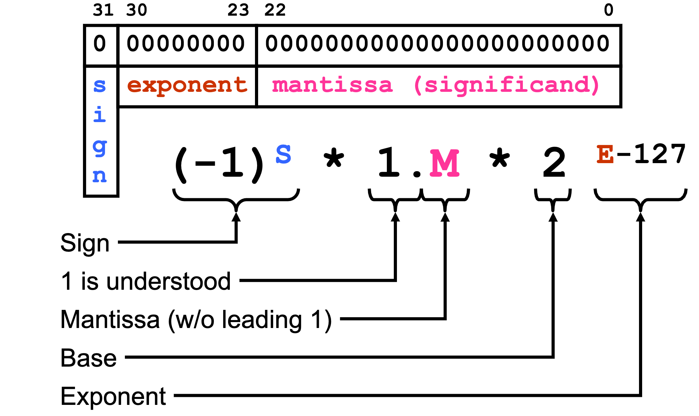
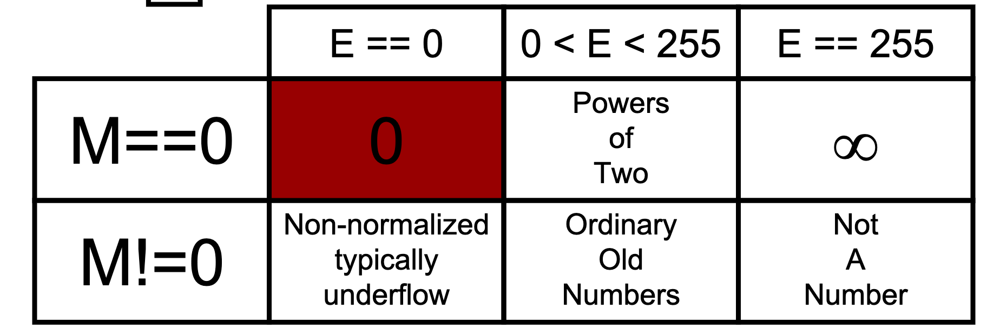

# 8/22/19-8/27/19 Logical Operations on Bits & Other Representations, Bitwise Review
- [8/22/19-8/27/19 Logical Operations on Bits & Other Representations, Bitwise Review](#82219-82719-logical-operations-on-bits--other-representations-bitwise-review)
    - [Bitwise Operators](#bitwise-operators)
        - [Manipulating Bits](#manipulating-bits)
    - [Shifting](#shifting)
- [Hexadecimal and Octal](#hexadecimal-and-octal)
- [ASCII](#ascii)
- [Floating Point Numbers](#floating-point-numbers)
    - [Edge Cases](#edge-cases)
    - [Casting Integer To Float, Then Back](#casting-integer-to-float-then-back)
    - [Comparing Floating Point #s](#comparing-floating-point-s)
        - [Bitwise Review](#bitwise-review)
## Bitwise Operators
**Bitwise And**
- 1 & 1 = 1
- 1 & 0 = 0
- 0 & 0 = 0
- 0 & 1 = 0

**Bitwise Or**
- 1 | 1 = 1
- 1 | 0 = 1
- 0 | 1 = 1
- 0 | 0 = 0

**Not**
- ~0 = 1
- ~1 = 0

**XOR-Exclusive Or**
- 1 ^ 1 = 0
- 1 ^ 0 = 1
- 0 ^ 1 = 1
- 0 ^ 0 = 0

**NAND-Not and**
- and the bits, then negate

**NAND-Not Or**
- or the bits, then negate

**NAND-Not Or**
- xor the bits, then negate

**Left shift**
- 0101 leftshift: 5 << 2 = 0100

**Right shift**
- 0101 rightshift: 5 >> 2 = 0001

**Arithmetic shifts**
- keep sign bit consistent

Activity: truth table for (p | q) & r

| P   | Q   | R   | p \| q | (p \| q) ^ r |
| --- | --- | --- | ------ | ------------ |
| 0   | 0   | 0   | 0      | 0            |
| 0   | 0   | 1   | 0      | 0            |
| 0   | 1   | 0   | 1      | 0            |
| 0   | 1   | 1   | 1      | 1            |
| 1   | 0   | 0   | 1      | 0            |
| 1   | 0   | 1   | 1      | 1            |
| 1   | 1   | 0   | 1      | 0            |
| 1   | 1   | 1   | 1      | 1             |

### Manipulating Bits

- bit vector: instead of treating bits as representing a number, use each bit as a boolean

        1011 = array of booleans where a[0] = true, a[1] = true, etc.

- use a mask (constant) with a boolean function
- clear a bit: 
    - use identity: WXYZ~2~ & 1111 == WXYZ~2~
    - so, but a 0 in any bit you want to clear

         WXYZ 
        &1011
        _____
        =W0YZ

- set a bit: 
    - use WXYZ~2~ | 0000 == WXYZ~2~
    - so, put a 1 in any bit you want to set

         WXYZ 
        |0010
        _____
        =WX1Z

- toggle a bit (flip a bit)
    - use exclusive or: WXYZ~2~ ^ 1111 == W\`X\`Y\`Z\`~2~
    - put a one in any bit you want to toggle

         WXYZ 
        ^0010
        _____
        =WXY`Z
- to test a bit, clear the rest 

        testing Y bit:
         WXYZ 
        &0010
        _____
        =00Y0
        
- to put a one in position in a mask, shift left

        1<<0 = 0001 (shift bit left by 0)
        1<<1 = 0010
        1<<2 = 0100
        
- to put a 0 in position in a mask, shift left to that position and complement

        ~(1<<2) = 1011
        
## Shifting
- left shift(<<)
    - shifts bits to the left; discards extra bits and appends 0 to the end
    - rule: x << n = x2^n^ (doesnt work with 2's complement)

        00000010 << 2 = 00001000
- right shift(`>>`(arithmetic) or `>>>`(logical))
    - logical shift: same as left; discard extra bits and append 0
    - arithmetic right shift: append most significant bit (the one furthest to the left)
        - acts like sign extension

        `11111001 >> 2 = 11111110`
        
# Hexadecimal and Octal

- convert from binary to octal
    - group binary every 3 digits
    - to go back, expand each octal digit to 3 bits

         10 110 010
        =2  6   2 in octal

- base 16 - hexadecimal (0~x~)
    - convert from binary to hex: group by 4 digits
    - to go back, expand each hex digit to 4 bits

         1011 0010
        =B(11) 2
        
# ASCII
- convert "A" to "a" (upper to lowercase)
    - use a mask to set bit 5 

         0100 0001 = 65 = "A"
        |0010 0000 (mask)
        =0110 0001 = 97 = "a"
        
- lower to upper: clear bit 5
    - char & 1101 1111 = uppercase char
- get binary number from ascii character

# Floating Point Numbers

- scientific notation
- formula:
    - !!! note (-1^s^) * 2^E-127^ * 1.M
        - where E is the exponent in unsigned 8 bit
        - M is the 23 bit mantissa
        - s is the sign
- diagram:

## Edge Cases

- can have +0 and -0
- when E == 0 and M!=0, the exponent is 2^-126^ instead (number before mantissa is 0 instead of 1)
- good link: [IEEE-754 Floating Point Converter](https://www.h-schmidt.net/FloatConverter/IEEE754.html)

## Casting Integer To Float, Then Back
- lose information because integers use 32 bits to store all, but floats have 1 bit for sign and 8 bits for exponent
    - use 64 bit double instead, so converting from int -> double -> int doesn't lose info

## Comparing Floating Point #s
- steps:
    - examine signs
        - if diff, + > -
        - if both +, compare magnitudes (start at bit 30), bigger magnitude is bigger
        - if both -, compare magnitudes, smaller magnitude is bigger

### Bitwise Review
- bitwise operators only apply to int, long, char, and short
- key: leading 0 = octal
    - leads with `0x` = hexadecimal
    - leads with `0b` = binary