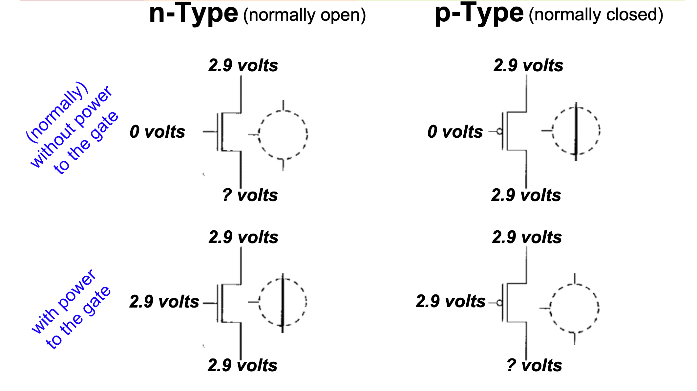

# 9/3/19 - Digital Logic
- [9/3/19 - Digital Logic](#9319---digital-logic)
    - [Types of Transistors](#types-of-transistors)
    - [Misconception: Wires Have 2 states](#misconception-wires-have-2-states)
    - [Logic Gates](#logic-gates)
    - [Combinational Logic](#combinational-logic)
    - [Decoder](#decoder)
    - [Multiplexors (MUX)](#multiplexors-mux)
    - [Adder](#adder)
    - [Useful Boolean Simplifications](#useful-boolean-simplifications)
    - [Truth Table to Circuit](#truth-table-to-circuit)
    - [Circuit to Boolean Expression](#circuit-to-boolean-expression)
    - [Equivalence](#equivalence)
    - [Karnaugh Map](#karnaugh-map)
    - [Grey Code](#grey-code)
## Types of Transistors
- N-type MOS - normally open
    - apply current, switch closes
- p-type MOS: apply current, switch opens

## Misconception: Wires Have 2 states
- wire has some designated voltage is a logical one
- wire with some designated voltage can b
- when wire is disconnected entirely, it is said to be __floating__ or in a **high impedence state**
    - value can be random from 0 to 1
    - __Still has current__

- fan-in: how many inputs go into a gate
- fan out: how many outputs that come out of a gate

## Logic Gates

- if there is a circle on it, there is an inverter on it
## Combinational Logic
- combo of AND, OR, NOT (NAND and NOR)

## Decoder
- way to convert binary number into unique output
- n input bits to 2^n^ unique outputs

## Multiplexors (MUX)
- selects between multiple input signals and converts it to a single output
- simple multiplexor has 1 output, n selector bits, and 2^n^ inputs

## Adder 
- adder truth table

- output: use XOR
- carry out: use AND
## Useful Boolean Simplifications
        A + AB = A (A or A & B = A)
        A + A'B = A + B
        (A + B) (A + C) = A + BC
## Truth Table to Circuit
- Use AND gate for every line in the truth table, connected to the input
- OR gate connecting the AND gates that have one in the output column

## Circuit to Boolean Expression
- if it's a sum-of-products (polynomial) circuit then each AND gate generates a term with the input conditions that yield a 1 (multiply)
- all of the terms are OR'd together (+) 

## Equivalence 
- Boolean expression
- truth table 
- combinatorial circuit 
- Karnaugh map 
    - all the same information, just different representations

## Karnaugh Map

- good video: (https://youtu.be/RO5alU6PpSU)
- used to simplify boolean logic
- uses grey code - only 1 bit changes between each row/column
- can only pair by powers of 2 - each pair removes a variable
- can group based on adjacency or wrapping around
- from truth table to KMap:
    - 1 = A, B, C
    - 0 = A', B', C'

## Grey Code
- only one bit changes at a time for the bit sequence

        2 Bit Grey Code
        00
        01
        11
        10