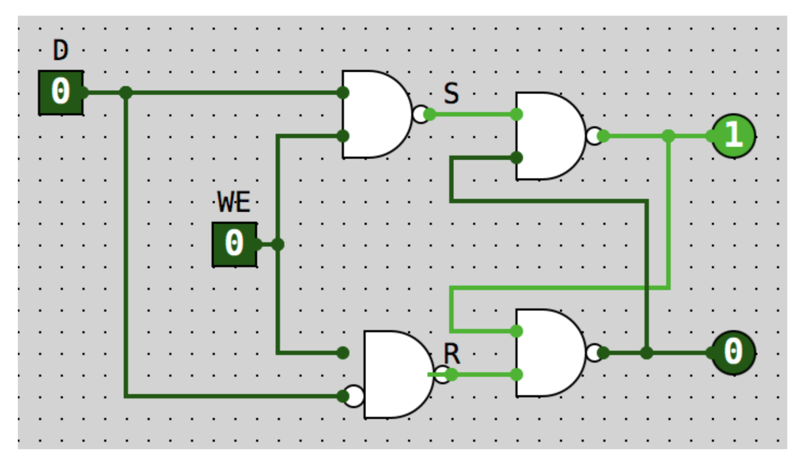
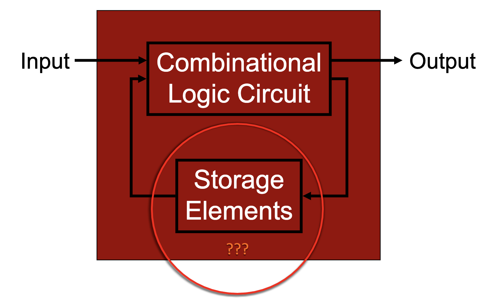
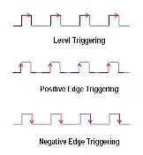

# 9/5/19 Digital Logic 2
<!-- toc -->

  * [R/S Latch](#RS-Latch)
  * [Gated D Latch (1 bit memory)](#Gated-D-Latch-1-bit-memory)
  * [Memory Definitions](#Memory-Definitions)
  * [Building Blocks of Memory](#Building-Blocks-of-Memory)
  * [What do we need for memory?](#What-do-we-need-for-memory)
  * [Combinational vs Sequential Logic](#Combinational-vs-Sequential-Logic)
  * [Level Triggered vs Edge Triggered](#Level-Triggered-vs-Edge-Triggered)
- [Finite State Machines](#Finite-State-Machines)
  * [Types of State Machines](#Types-of-State-Machines)

<!-- tocstop -->
## R/S Latch
- never let r and s be both 0
- top right is what you are storing
- bottom left is the inversion of what you are storing

## Gated D Latch (1 bit memory)
- what if we want to remember the input?
- D: input we want to record
- WE: write enable: "record" button; if 0, then D is not stored, if 1, then d is stored

## Memory Definitions
- address space - total number of unique values of memory
- addressability - how many bits are stored in each memory location

## Building Blocks of Memory
- use register
    - gated d latch
- decoder
- mux

## What do we need for memory?
- address space 
- Write enable
- input for data
- output for data

## Combinational vs Sequential Logic
- Combinational:
    - combo of and, or, not
    - same inputs produce same output
    - like a bicycle lock: doesn't matter what order you enter inputs
- Sequential
    - requires storage elements
    - output depends on inputs plus state
    - like a combo lock

    - takes the output bits and it feeds back into the storage elements (uses memory/register)

## Level Triggered vs Edge Triggered
- level triggered: RS latch
    - circuit becomes active when a clock is on a particular level
- edge triggered: d flip flop
    - circuit becomes active at the positive or negative edge of a clock signal

# Finite State Machines
- decide how we will encode states
    - use binary
- draw state diagram
    - use labeled states, outputs, arc with ocnditions for state changes
- create truth tables
    - inputs: circuit inputs and current states
    - outputs: circuit outputs and next state
- implement combinational circuit for each output

## Types of State Machines
- One hot 
    - one bit per state
    - only one bit is on at a time
    - faster
    - requires more flip flops

    progress: 000001 -> 000010 -> 000100 ...
- Binary encoded
    - encode state as a binary number
    - use a decoder to generate a line for each state
    - slower
    - more complicated

    progress: 000 -> 001 -> 010 ...