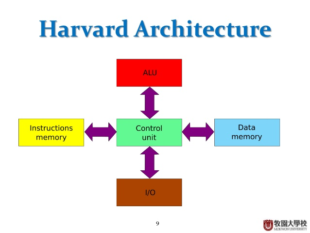
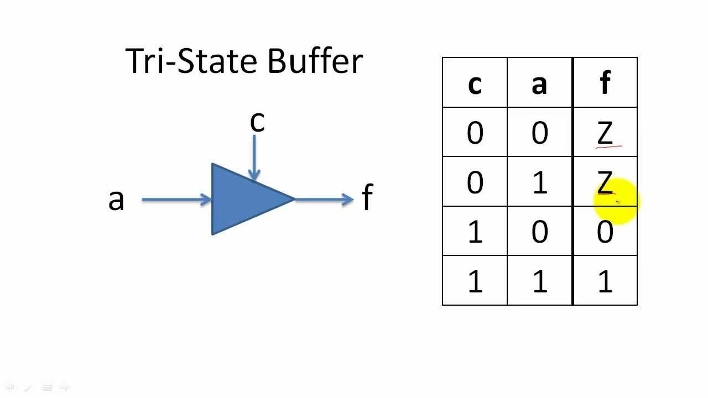

# 9/12/19 - Von Neumann Model
- [9/12/19 - Von Neumann Model](#91219---von-neumann-model)
    - [Machine Instructions as Data](#machine-instructions-as-data)
    - [LC3 CPU](#lc3-cpu)
    - [BUS](#bus)
- [LC3](#lc3)
    - [Instruction Cycle](#instruction-cycle)
    - [Register File Circuit](#register-file-circuit)
    - [Program Counter Circuit](#program-counter-circuit)
    - [Instruction Processing - FETCH](#instruction-processing---fetch)
    - [Instruction Processing - Decode](#instruction-processing---decode)
    - [Instruction Processing: EVALUATE ADDRESS](#instruction-processing-evaluate-address)
    - [Instruction Processing: FETCH OPERANDS](#instruction-processing-fetch-operands)
    - [Instruction Processing: Execute](#instruction-processing-execute)
    - [Instruction Processing: STORE RESULT](#instruction-processing-store-result)

- Harvard Architecture: split up instructions and data memory
- Von Neumann central idea: program and data are both stored as sequences of bits in the computer's memory (combined)
    - advantage: can optimize one memory instead of multiple

## Machine Instructions as Data
- represent machine instructions as sequencees of bits

## LC3 CPU
- address space: 2^16^ = 65536
- addressability: 16 bits
- architecture type: Von Neumann
- general purpose registers: 8
- instruction size: 16 bits

## BUS
- contains tri state buffer - separates wires, and prevents 2 signals being sent from the same wire (prevents short circuits)
- in the LC3, is a 16 bit wire that transfers

# LC3
**PC - Program Counter**
- holds memory address where next instruction is going to be executed

**IR - Instruction Register**
- holds instruction currently being executed

## Instruction Cycle
1. fetch memory
2. decode
3. evaluate address
4. fetch operands
5. execute
6. store result

## Register File Circuit
- "memory" with 8 16 bit registers
- 2 output controllers - sr1 and sr2 (3 bits)
- one input controller - DR (3 bits - specifies which of the 8 registers to store the bits) and LD.REG (write enable)
- cycles with CPU clock
- can read from 2 registers, and write to 1 register

## Program Counter Circuit
- holds memory where next instruction will be executed
- has a PCMUX - decides whats the value of the PC will be
    - adder to increment Program Counter
    - data from bus to program counter
    - data from effective address calculator to PC

## Instruction Processing - FETCH
- load next instruction (at address stored in PC) from memory into IR
    - copy contents from PC into MAR
    - send "read" signal to memory
    - copy contents from MDR to IR
- increment PC so that it points to the next instruction in sequence
    - PC = PC + 1

## Instruction Processing - Decode
- identify the opcode
    - in LC3, always 4 first bits of instruction
    - FSM chooses next state corresponding to the desired opcode
- depending on the opcode, identify other operands from remaining bits
    - ex) for LDR (load data from memory), last 6 bits are offset; for ADD, last 3 bits is source operand 2

## Instruction Processing: EVALUATE ADDRESS
- For instructions that require memory access, compute the address to be used for access.
    - ex) add offset to base register

## Instruction Processing: FETCH OPERANDS
- Obtain source operands from memory needed to execute the operation.
    - ex) load data from memory, or bring data from register

## Instruction Processing: Execute
- Perform the operation, using the source operands.
    - ex) send operands to ALU and assert add control signal
## Instruction Processing: STORE RESULT
- writes result to memory/register
    - write address to MAR (memory address register)/MDR(memory data register)