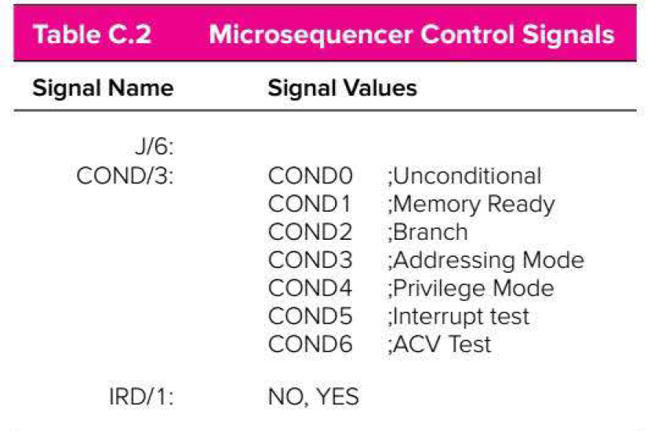

# 9/17/19 - The LC3 Datapath
# Page 669 for Instruction Set and What they do
- [9/17/19 - The LC3 Datapath](#91719---the-lc3-datapath)
- [Page 669 for Instruction Set and What they do](#page-669-for-instruction-set-and-what-they-do)
- [OP Codes](#op-codes)
    - [Instruction Set Architecture](#instruction-set-architecture)
- [Data Path Control Signals](#data-path-control-signals)
    - [LC3 Memory Organization](#lc3-memory-organization)
    - [LC3 Registers](#lc3-registers)
    - [Instruction Set](#instruction-set)
    - [Types of Processor Design](#types-of-processor-design)
    - [LC-3 Instruction Set](#lc-3-instruction-set)
    - [LC3 Assembly Language](#lc3-assembly-language)
    - [Addressing modes](#addressing-modes)
- [3 Types of Statements](#3-types-of-statements)
    - [ALU Operations (bitwise ops)](#alu-operations-bitwise-ops)
    - [Control Operations](#control-operations)
    - [Data Flow](#data-flow)
    - [Fetch-Execute Cycle](#fetch-execute-cycle)
    - [Operate Instruction Example](#operate-instruction-example)
    - [ALU - Only has AND, ADD, NOT](#alu---only-has-and-add-not)
    - [Changing Sequence of Control Instructions](#changing-sequence-of-control-instructions)
        - [JMP - Jump](#jmp---jump)
        - [BR - Branch](#br---branch)
        - [Condition Codes](#condition-codes)
        - [Control Unit (FSM)](#control-unit-fsm)
        - [Control Structure Diagram](#control-structure-diagram)
        - [Microsequencer Control Signals](#microsequencer-control-signals)
        - [Microsequencer Job](#microsequencer-job)
    - [Fetch Stage Example](#fetch-stage-example)
        - [Branch Example](#branch-example)
    - [Data Movement Instructions](#data-movement-instructions)
    - [Loading Register Operations](#loading-register-operations)
    - [Storing Register Procedure](#storing-register-procedure)
- [9/23/19 - LC3 Key Components](#92319---lc3-key-components)
    - [BUS](#bus)
    - [Microcontroller](#microcontroller)
    - [Memory](#memory)
    - [PC](#pc)
    - [ALU](#alu)
- [LC3 Part 2](#lc3-part-2)
    - [What we can do BR](#what-we-can-do-br)
    - [What we can do with JMP](#what-we-can-do-with-jmp)
    - [BR vs JMP](#br-vs-jmp)
- [General Steps to Write Assembly Program](#general-steps-to-write-assembly-program)
    - [Code Templates](#code-templates)
# OP Codes

## Instruction Set Architecture
- what is specified
    - memory organization
    - registers
    - instruction set
        - opcodes, data types, addressing modes
# Data Path Control Signals

## LC3 Memory Organization
- 16 bit addresses
- addressability: 16 bits
    - address space: 2^16^
- word addressable/byte addressable? (word means the natural size where the cpu is handling data)
    - strictly word addressable with 16 bit words

## LC3 Registers
- General purpose register
    - 8 registers
    - R0 - R7
- is the PC a general purpose register - no
- certain registers have specific purposes

## Instruction Set 
- Instruction - op code, operands
- instruction set 
    - op code - operate, data movement, control
    - data types 
    - addressing modes

## Types of Processor Design
- CISC
    - do as much as you can in a single instruction
    - used in most CPUs today
- RISC
    - expose as much as you can to the compiler so it can optimize
    - used in the LC3

## LC-3 Instruction Set
- 16 bit instructions
- 4 bits for opcode
- 15 instructions

## LC3 Assembly Language
- symbolic representation of binary machine language

## Addressing modes
- where operands can be found
    - in the instruction (literal/immediate)
    - in registers
    - in memory
- based on the addressing mode of instruction, use the term effective address to describe the location that the instruction uses for its operands
- modes
    - immediate/literal - has some constant value/expression
    - register - register contains operand
    - pc - relative - take program counter and add constant
    - indirect - operand's offset is placed in a register specified in the instruction
    - base + offset - uses arithmetic operators to modify address

# 3 Types of Statements
## ALU Operations (bitwise ops)
- add, and, not

## Control Operations
- calls functions
- BR(if/else statement), JSR/JSRR (calling a function), JMP/RET(jump/return), RTI/TRAP

## Data Flow
- LD/ST (load/store data), LDR/STR (load register/store register), LDI/STI, LEA

## Fetch-Execute Cycle
- state machine sequences through the different states
    - turns on correct control signals as it enters each state
## Operate Instruction Example

- the top operation is a register addressing mode (SR1 + SR2)
- bottom operation is an immediate addressing mode (SR1 = SR1 + imm5)
    - imm5 is a 5 bit 2's complement number [-16,15]

## ALU - Only has AND, ADD, NOT
- add
- and 
- not
- __subtract__: use adder and 2's complement conversion
- __or__: use demorgan's law `~(~R2 & ~R3)`
- **clear register**: AND with 0: `AND R1, R1, 0`
- **copy one register to another**: `ADD R1, R2, 0` - add r1 to r2
- **increment a register by 1**: `ADD R1, R1, 1`

## Changing Sequence of Control Instructions
- change the program counter
- examples of changing sequence: for loop, if/else
- control instructions: change contents of the PC
    - jumps always change PC
    - branches are conditional: only change pc if some condition is true

### JMP - Jump

- set the PC to the value contained in a register
- copies R3 from register file through ALU, BUS, and PCMUX to PC
**Execute State**

### BR - Branch

### Condition Codes
- NZP - 3 bits
    - negative, zero, positive
- code is set when LD.CC is high, during EXECUTE
- code is used in the BR instruction where it is ANDed with the NZP bits, if any bits are on, BR is taken, otherwise next instruction is fetched

### Control Unit (FSM)
- controls flow of data in LC3
- uses a built in program - called microcode
- each cycle through microcode executes on LC3 machine instruction
- microcode itself runs on a smaller sequential logic circuit to choose from 64 possible States
- components:
    - control store
    - microsequencer
### Control Structure Diagram

- top are inputs, go through microsequencer
    - microsequencer's job is to determine the address in the control store that corresponds to the next state
- control store: stores each microinstruction in memory, and takes in 6 bits to spe
- output (microinstruction): 42 bits to control processing of the the data path, and 10 bits to determine next state

### Microsequencer Control Signals


### Microsequencer Job
- determine the next state using 10 bits
    - IRD – a one-bit mux control that gates either IR[15:12] or the combination of COND and J back to the microsequencer as the next state
    - COND[2:0] allows one bit of J[5:0] to be set based on a specific signal

            000 - unconditional
            001 - memory ready
            010 - branch
            011 - addressing mode
            100 - privelage mode
            101 - interrupt present
    - J[5:0] – a six-bit number that is the address of the next state (if not modified by COND)

## Fetch Stage Example
- J: 6 bit number of address of next state
- state 18 starts fetch
    - Memory address register = PC
    - PC = PC + 1
    - COND5 and J=33 (if interrupt go to 33+16=49 else 33)
- state 33 waits for read complete
    - assert MEM.EN
    - Memory data register = Memory[Memory address register]
    - COND1 and J=33 (if R go to state 33+2=35 else 33)
- state 35 moves instruction to IR
    - IR = memory data register
    - COND0 and J=32 so next state is 32
- notice that next state is simply a modified version of J, done by changing COND

            COND5 says “Set bit 4 (+16) in J if an interrupt is waiting”
            COND1 says “Set bit 1 (+2) in J if memory is Ready
            COND0 says “Use unmodified J”
            
### Branch Example
- state 32 does decoding
    - BEN <- IR[11] & N | IR[10] & Z | IR[9] & P
    - State 32 has IRD=1 for next state
- State 0 is chosen for a BRx instruction
    - State 0 has J=18 and COND2 for next state
    - The next state will be 18 if BEN is 0 or 22 (18 + 4) if BEN is 1
- State 22 changes the PC
    - PC <- PC + off9
    - State has J=18 and COND0, so next state is 18
    - 18 starts next fetch cycle

## Data Movement Instructions
- Data movement instructions move
    - Memory to a register
    - A Register to memory

## Loading Register Operations
- LEA: Puts the address represented by some label into a register
- LD: Puts the contents of some label (address) into a register
- LDI: Puts the contents of memory location whose address is stored in memory at some label into a register
- LDR: Puts the contents of the effective address into a register. The effective address is computed by adding the base register to the offset which is the offset6 immediate operand

## Storing Register Procedure
- ST: Puts the contents of a register into an address specified by a label (address).
- STI: Puts the contents of a register into a memory location whose address is stored in memory at some label
- STR: Puts the contents of the source register into memory at some effective address. The effective is calculated by adding the base register to the offset6 immediate operand.
# 9/23/19 - LC3 Key Components

## BUS
- contains tri-state buffer-prevents multiple signals from going across the same wire
- 16 bit wire in LC3

## Microcontroller
- finite state machine
- each state determines flags that need to be set in the datapath
- ensures correct operations take place

## Memory
- load
    - address of data in MAR - memory address register
    - memory is read from that address and driven to MDR - memory data register
- store
    - data is in MDR
    - address to store is at MAR

## PC 
- program counter
    - address of next instruction to execute
- 3 ways to update PC
    - PC + offset
    - PC + 1
    - give a value to PC via a BUS

## ALU
- 2 inputs
    - data from 2 registers or data from 1 register/immediate value from instruction
- select bit comes from FSM
    - `00 = A + B`
    - `01 = A AND B`
    - `10 = NOT A`
    - `11 = PASS A` (no change)
- drives output onto a BUS
    - condition codes - set when writing to general purpose registers = LD.CC Flag
        - NZP - based on value of bus

# LC3 Part 2

## What we can do BR
- If, then, else
- for
- while
- do while
- unconditional branch (BRNZP or BR)
- conditional branch
- Never branch(NOP)

## What we can do with JMP
- go to ___
- branch long distances

## BR vs JMP
BR
- can branch on n,z,p
- can always branch
- can never branch
- Destination address is always PCoffset9
- Can’t branch more than -256 to 255 words

JMP
- Always branches
- Destination address always in a register
- Can branch to any memory address

# General Steps to Write Assembly Program
- write pseudocode in java
- turn pseudocode into assembly language comments
```assembly
; int S = 0;
; int M = x3100;
; int C = 12;
; while (C > 0) {
; S = S + Mem[M];
; C = C - 1;
; M = M + 1;
; }
```
- decide where vars will be stored
- set registers if needed (if ints need to be 0)

## Code Templates
- if (R1>0) then .. else ..

- for(init; R1>0; reinit)

- While (R1>0)

- do ... while (R1>0);

- if (A == 0 && B == 0)


- if-then-else

- for
