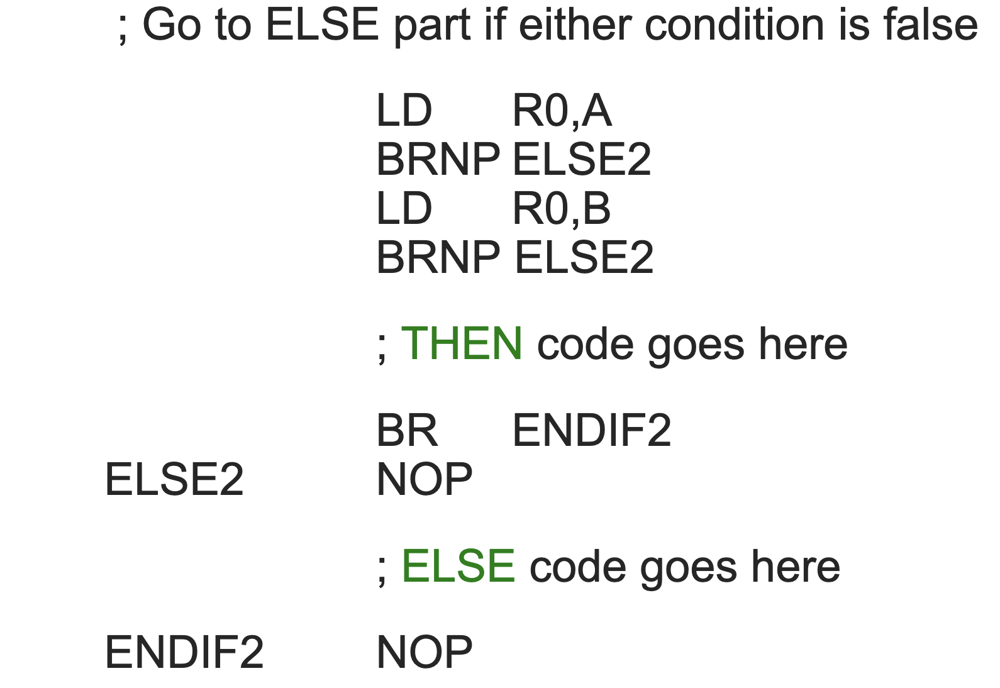

# 10/1/19 - Assembly
- [10/1/19 - Assembly](#10119---assembly)
    - [Labels](#labels)
    - [Pseudo Ops](#pseudo-ops)
    - [Example](#example)
    - [TRAPS - Aliases](#traps---aliases)
    - [BR](#br)
    - [LD](#ld)
    - [LDR](#ldr)
    - [LEA](#lea)
    - [LDI](#ldi)
    - [ST](#st)
    - [STR](#str)
    - [For Loops using BR](#for-loops-using-br)
    - [Assembly Process](#assembly-process)
    - [Two Pass Assembly](#two-pass-assembly)
    - [TRAP Aliases](#trap-aliases)
    - [Code Templates](#code-templates)
- [Input/Output](#inputoutput)
    - [Async vs Sync](#async-vs-sync)
    - [2 Methods of Doing I/O](#2-methods-of-doing-io)
    - [Device Registers](#device-registers)
    - [Keyboard Input](#keyboard-input)
    - [Monitor Output](#monitor-output)
## Labels
- allow you to assign names to memory addresses - like variables
## Pseudo Ops
- `.orig`: specifies the starting address of program in memory 
    - `.orig x3000`
    - This address is placed in the PC @ start of program execution.
- `.end` denotes end of block, exit tag for `.orig`
- `.stringz`: assembler puts a string of characters in consecutive memory followed by a null terminating character `\0`
- `.blkw`: "block out word" - allocates memory for a label to be used later
    - `blkw 10` - blocks out 10 words of memory for future use
- `.fill` : puts value in memory location for later
    - `.fill 42`: puts value `42` in that position in memory to be referenced later by a label

## Example 


## TRAPS - Aliases
- `HALT` - stops program from running
- `OUT` - prints out the ASCII character corresponding to the value in R0
- `PUTS` - prints out the string of characters starting at address stored in R0
- `GETC` - takes in character input and stores it in R0

## BR
- useful for looping
- checks the condition code for the statement preceding it, and branches to a label according to the `nzp` flag

```
.orig x3000
    AND R0, R0, 0 ;clears out R0
    AND R1, R1, 0 ;clears out R1 - our result
    ADD R0, R0, 5 ;Adds 5 to R0 and R0 is number, so number = 5
    LOOP ADD R1, R1, 2
    ADD R0, R0, -1;our iterator
    BRP LOOP ;checks the conditional code.;Until our iterator reaches zero, we will keep branching to the label LOOP
```

## LD 
- loads value at memory address from label into the register

```assembly
orig x3000
    LD R0, X ; loads the value at the memory address X, 2 -> R0
    HALT
X  .fill 2 ; the memory address labeled ’X’ contains the value 2
.end
```

## LDR
- load base + offset
- loads memory address of the register plus an offset added to the memory address into the register

```
.orig x3000
    LD R0, HELLO ;loads the address of the label HELLO into R0
    LDR R1, R0, 1;takes the memory address x6000 located in R0 and adds 1 -> x6001
                ;Goes into memory at x6001 and retrieves the data ’i’
                ;and places the ASCII value in R1
    HALT
HELLO .fill x6000
.end
.orig x6000.
    stringz "Hiya\n"
.end
```
## LEA
- load effective address
- loads the actual memory address represented by label into a register
    - compared to LD/LDR where it loads the actual data from the register/label into another
```
.orig x3000
    LEA R0, BESTCS ;will load the address represented by the BESTCS label into R0
    PUTS ;using the starting address located in R0
         ;will print a string of characters until reaching the null character
    HALT
BESTCS .stringz "CS2110\n"
.end
```

## LDI
- load indirect
- loads memory address from label into register
## ST
- store
- contents of register is stored into specified memory location
```
.orig x3000
    AND R0, R0, 0 ;clear R0
    ADD R0, R0, 15 ;puts 15 in R0
    ST R0, ANSWER ;this operation stores whatever is in R0 (15)                             ;into the memory address represented by ANSWER
    HALT
.end
ANSWER .blkw 1 ;blocks one word of memory
```

## STR
- store base + offset
- puts contents of 1st register into the memory address that the 2nd  register plus an offset

```
orig x3000
    AND R0, R0, 0 ;clear R0
    ADD R0, R0, 15 ;puts 15 in R0
    LEA R1, ANSWER ; Load address of ANSWER into R1
    STR R0, R1, 1 ; Store R0 (15) into the address in R1 + 1 
    HALT
.end
ANSWER .blkw 1 ;blocks one word of memory
```

## For Loops using BR
```java
int number = 5;
int result = 0;
for (int i = 0; i < number; i++) 
{
    result = result + 2;
}
```
```
.orig x3000
    AND R0, R0, 0 ;clears out R0
    AND R1, R1, 0 ;clears out R1 - our result
    ADD R0, R0, 5 ;adds 5 to R0 - R0 is our number that we will decrement
LOOP ADD R1, R1, 2
    ADD R0, R0, -1;our iterator
    BRP LOOP    ;checks the conditional code Until our 
                    iterator reaches zero, we will keep branching 
                    to the label LOOP
    HALT
.end    
```

## Assembly Process
- translate assembly language to machine language
- each assembly instruction yields a machine language word
- problem: labels
- solution: two - pass assembly

## Two Pass Assembly
- 1st pass: generate symbol table
    - add labels with their associated memory addresses to table
    - keep track of current address - location counter
- 2nd pass: generate machine language
    - translate each line into ML
    - look up labels in symbol table

## TRAP Aliases
- TRAP x25 = HALT
- TRAP x23 = IN ;Input character from kybd
- TRAP x21 = OUT;Print character on screen
- TRAP x22 = PUTS
- TRAP x24 = PUTSP
- TRAP x20 = GETC

## Code Templates
- if (R1>0) then .. else ..

- for(init; R1>0; reinit)

- While (R1>0)

- do ... while (R1>0);

- if (A == 0 && B == 0)


- if-then-else

- for


# Input/Output

## Async vs Sync
- Async
    - data rate less predictable
    - cpu must synchronize with device
- Sync
    - data is supplied at a predictable rate
    - cpu reades/writes at predictable cycles

## 2 Methods of Doing I/O
- Special IO Instructions
    - need opcode
- memory mapped
    - steal part of address space for device registers
    - Operations done by reading/writing bits in the device registers

## Device Registers
- Data registers: Used for the actual transfer of data i.e. character code
- status registers: Information the device is telling us
- Control registers: Allows us to set changeable device characteristics

## Keyboard Input
- KBSR - (xFE00)
    - only uses one bit - bit 15
        - set when char is available
- KBDR - (xFE02)    
    - read - only 
    - reading clears KBSR

## Monitor Output
- DSR (xFE04)
    - transferring char to DDR clears DSR
    - When monitor is finished processing a character it sets DSR bit 15
- DDR (xFE06)
    - Transfer character to this address to print it on the monitor