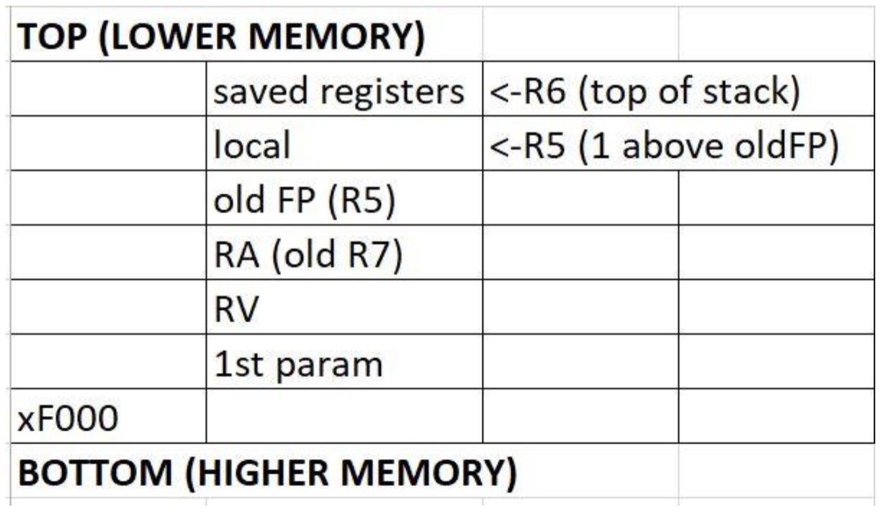
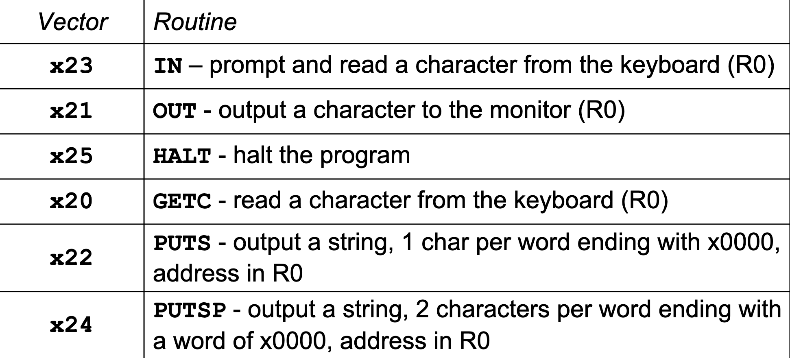

# 10/8/19 - Stack & Subroutines
- [10/8/19 - Stack & Subroutines](#10819---stack--subroutines)
- [Purpose of the Stack](#purpose-of-the-stack)
    - [How the Stack Grows](#how-the-stack-grows)
    - [Stack Notes](#stack-notes)
    - [LC3 Commands for Calling Subroutines](#lc3-commands-for-calling-subroutines)
    - [Calling Convention](#calling-convention)
        - [Important Registers](#important-registers)
    - [What Does JSR Do](#what-does-jsr-do)
    - [JSRR](#jsrr)
    - [RET](#ret)
    - [TRAP](#trap)
- [Stack](#stack)
    - [Basic Ideas](#basic-ideas)
    - [Stack convention](#stack-convention)
    - [Pushing and Popping From Stack](#pushing-and-popping-from-stack)
    - [Stack Calling convention](#stack-calling-convention)
        - [Callee](#callee)
    - [Calling convention Example](#calling-convention-example)
    - [Stack frame Diagram](#stack-frame-diagram)
    - [General Outline of Subroutine](#general-outline-of-subroutine)
- [Recursion](#recursion)
# Purpose of the Stack
- used for subroutines and function calls
- why we use the stack
    - save the state of the CPU through function calls
    - saving local variables
    - passing parameters

## How the Stack Grows
- main methods is the "caller" of another function, which is a "callee"
- every time we call a function, add a stack frame

## Stack Notes
- stack grows from high to low memory
- stack and heap grow toward each other

## LC3 Commands for Calling Subroutines
- JSR - jump to subroutine
- RET - return
- JSRR - jump to subroutine relative to base register
- JMP - unconditional jump with a base register

## Calling Convention
- saved registers - registers that are used in function - top of the stack
- 1st local variable - where the frame pointer is pointed
    - if more than one local variable, 2nd would be above
- old frame pointer (R5)
- RV = return value
- RA = return address
- parameter list
    - 1st param
    - 2nd param

### Important Registers
- R7
    - holds current return address
- R6
    - holds stack pointer/top of stack
    - increment/decrement this when you want to push/pop things onto the stack
- R5
    - holds current frame pointer
    - useful when we want to obtain values onto the stack

## What Does JSR Do
- `R7 <- PC` - puts PC into R7
- `PC <- PC + PCOffset11` <- PC is incremented by offset11

## JSRR
- `R7 <- PC`
- `PC <- BaseR` - jump to base register

## RET
- jumps to R7

## TRAP
- uses trap vector table
- like a operating system subroutine
- like and indirect JSR with a choice of memory location from [0,255] (which is the trap vector)
- op code:

        1111 0000 TRAPVECT8
- common trap numbers:

# Stack
- purpose: allow us not to overwrite registers when doing recursion and going into subroutines
## Basic Ideas
- stack is located at some location in memory
- store address of top of stack somewhere
- stack "grows" down to lower memory addresses

## Stack convention
- implemented in memory
    - top of stack pointer is stored at  R6

## Pushing and Popping From Stack
- push
    - decrement stack pointer (grow downward in memory)
    - write data in R0 to new top of the stack
- pop
    - read data at current top of the stack into R0
    - increment stack pointer
- if stack is full or empty
    - must test for overflow/underflow
- ignore bounds checking in this class

## Stack Calling convention
- how we make a call
    - push parameters
    - save registers
    - JSR
- what we do when call returns
    - restore registers
    - examine return value
    - pop return value and parameters

### Callee
- when procedure is called
    - save registers
    - examine params
    - make room for local vars
- do work for procedure
- When procedure is about to return
    - Restore registers
    - Prepare return value
    - RET
## Calling convention Example
- `y = foo(a, b, c)`
- Caller: Push args onto stack right to left!
- caller: jump to subroutine
- callee: move stack pointer and save registers and most of everything
- caller: grab return value
- caller: deallocate space for args and return value

## Stack frame Diagram
- caller pushes N arguments onto stack, but pops N + 1 words - looking for return value
- callee pushes M words to stack frame, but pop M - 1 to leave room for 
- R7 holds current return address
                                   
                            -------------- Low Memory
                                                        R5 Offset
        R6 Stack Pointer -> saved R4                    -5
                            saved R3                    -4
                            saved R2                    -3
                            saved R1                    -2
                            saved R0                    -1
                            --------------
                            Additional local variables
        R5 Frame Pointer -> 1st local variable           0
                            (even if there are no local vars)
                            --------------
                            old frame pointer (R5)    +1
                            old return address (R4)   +2
                            --------------
                            return value                +3
                            -------------- below by caller, above by callee
                            Arg 1 (parameter list)      +4
                            Arg 2                       +5
                            Arg 3                       +6
                            ...
                            ...
                            ...
                            -------------- High Memory
                            
## General Outline of Subroutine
- build stack Frame
- do function work
- save return value
- tear down stack frame 
- RET

# Recursion 
- when using the calling convention, recursion isn't anything different - just like calling another function