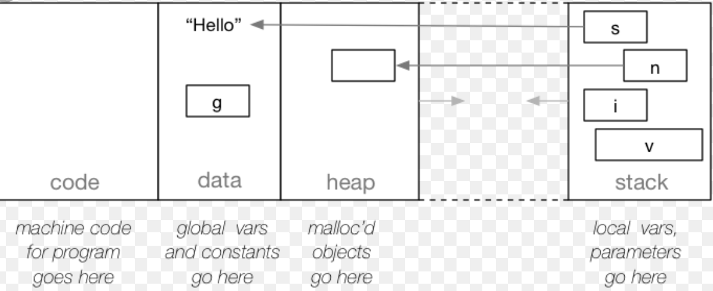
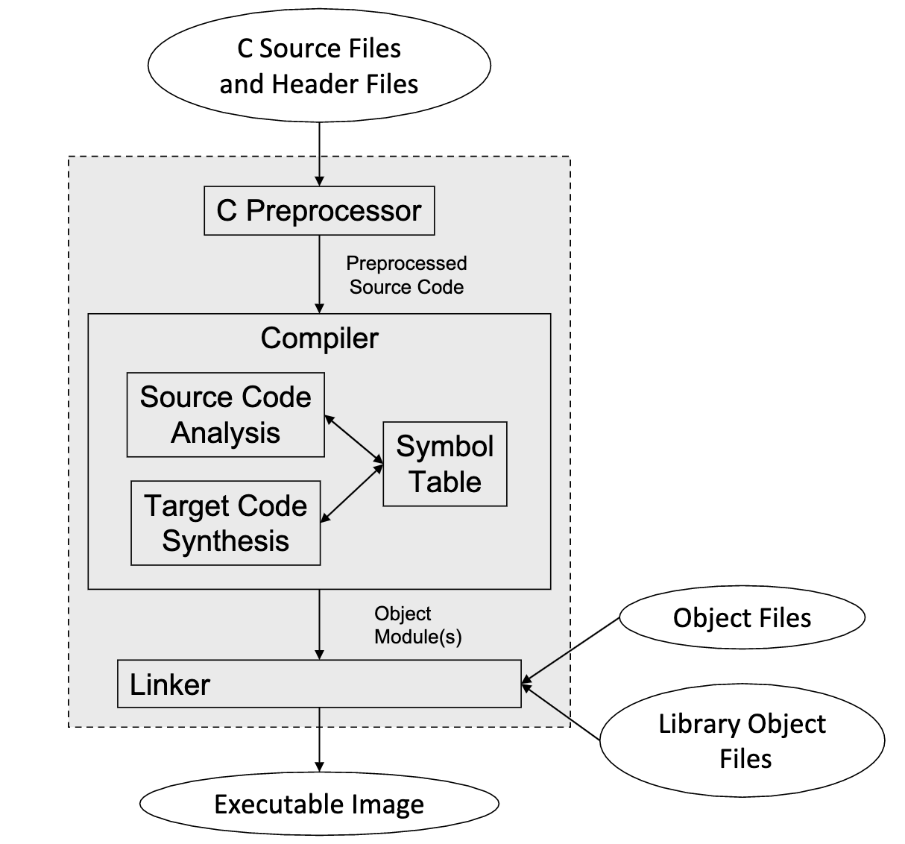

# Intro To C
- [Intro To C](#intro-to-c)
- [10/21/19 - Intro to C Recitation](#102119---intro-to-c-recitation)
    - [C Compilation](#c-compilation)
        - [C Source Files](#c-source-files)
        - [C Header Files](#c-header-files)
        - [1. PreProcess C Code](#1-preprocess-c-code)
        - [2. Compiled Code](#2-compiled-code)
        - [3. Binary Code](#3-binary-code)
        - [4. Executable](#4-executable)
    - [C Memory Regions](#c-memory-regions)
    - [Type Qualifiers and Storage Class Modifiers](#type-qualifiers-and-storage-class-modifiers)
        - [Static](#static)
        - [Volatile](#volatile)
        - [Extern](#extern)
        - [Auto](#auto)
        - [Const](#const)
    - [Macros](#macros)
    - [Structs](#structs)
    - [TypeDefs](#typedefs)
    - [MakeFile](#makefile)
- [10/17/19 - Intro to C lecture](#101719---intro-to-c-lecture)
    - [Java vs C](#java-vs-c)
    - [Design Goals](#design-goals)
    - [Storage Differences](#storage-differences)
    - [Control Statements and Expressions](#control-statements-and-expressions)
    - [More Differences](#more-differences)
    - [The Compiler](#the-compiler)
    - [Scopes](#scopes)
    - [Data types](#data-types)
    - [Structs](#structs)
    - [TypeDefs](#typedefs)
    - [Printf](#printf)
    - [C Preprocessor](#c-preprocessor)
        - [#include](#include)
        - [Macro Expansion](#macro-expansion)
    - [Macros With Args](#macros-with-args)
    - [Pointers](#pointers)
    - [Using Pointers](#using-pointers)
    - [Another Pointer Syntax](#another-pointer-syntax)
    - [Pointer Arithmetic](#pointer-arithmetic)
    - [Dynamic Storage](#dynamic-storage)
    - [malloc](#malloc)
    - [Done with a chunk of storage](#done-with-a-chunk-of-storage)

<!-- tocstop -->
# 10/21/19 - Intro to C Recitation
## C Compilation

Overall Process:
- Preprocess C code
- compile C code into assembly
- assemble assembly code into binary
- linker makes into executable
### C Source Files
- source files are where function will be written
### C Header Files
- contain function declarations or global variables from to be shared between source files

### 1. PreProcess C Code
- result after condition checks have been executed and macros have been substituted

### 2. Compiled Code
- C code translated into assembly

### 3. Binary Code
- assembly dissassembled into binary

### 4. Executable
- binary code made into object file; linker takes multiple object files and turns them into an executable

## C Memory Regions


- Data is where global variables and static variables will be stored.  Similar to the heap, variablesstored here will outlive function calls.  So a static variable,  for example,  will persist across multiplecalls to the same function.
- The last region, code, is simply where your executable code gets stored!
- rest is same as lc3

## Type Qualifiers and Storage Class Modifiers
### Static 
- next to function: means not visible outside of C file (like private)
- next to local variable outside function - visible only within file
- next to local variable inside function: value retained for multiple function calls
    - stored in data segment

### Volatile
- variable will change outside of the function that it is declared in, so compiler doesn't optimize it away
- stored in the data portion of memory

### Extern
- tells compiler variable is declared in another file
- stored in data portion

### Auto
- put variable on stack - all variables are default auto; not very useful
- stored on stack

### Const
- variable cannot be modified
- depends if they are static

## Macros
- preprocessor directive
- basically advanced text replacement
- always put parentheses around arguments in expression

```c
//basic syntax
#define MACRO_NAME(ARGUMENTS) (TEXT_REPLACEMENT - (var1) + (var2))

#define MULTIPLY(X, Y) ((X)*(Y))
...
int sum = MULTIPLY(3+4, 5+6);
```
## Structs
- data type in C that can contain multiple variables of different types
```c
struct myStruct {
    int number;
    char* letter;
};

//usage and initialization
struct myStruct myVar;
myVar.number = 5;
```
## TypeDefs
- create new name for a type of an existing one
- allows you to not need to use the keyword `struct` before instantiating the type

```c
typedef struct Dog {
    int tails;
    int feet;
} Puppy;
// can use Puppy to represent the struct called dog
```
## MakeFile
- goal: update/make a specific target
- Target: task you are trying to complete by executing commands sequentially
    - updated based on state of it's prereqs
- prereqs: other targets
# 10/17/19 - Intro to C lecture
- C is a procedural language
    - descended from FORTRAN, children are Java, Python, etc.
- used to write OS, drivers, networking
- doesn't check for runtime errors
- have to be deliberate - C won't catch things for you

## Java vs C
- not object oriented
- structs are used instead of classes; unions support polymorphism
- pointers are used instead of object references
- must have unique function names

## Design Goals
- use as little run time memory as possible
- make system memory accessible to privelaged programs

## Storage Differences
- int datatypes: char, short, long, int, long long
    - changing in between don't require casting
- strings are char arrays that end in `'\0'` 
- store local vars in stack, dynamic structs/objects into heap

## Control Statements and Expressions
- expressions are similar
    - no `new` keyword
    - all expressions yield value
    - `sizeof`, mathematical`&`, mathematical`*`, binary `->`
- control statements are same - if/else, while, for, switch, break

## More Differences
- no package, thread, exception, or garbage collection
- program files are compiled seperately to machine code and linked together with libraries using a linker
- no runtime bounds checking
- i/o, heap management, math functions through function in standard library - not supported in language itself

## The Compiler 


## Scopes
- no nested functions
- name scopes based on where names are declared and they also describe where the names can be used
- scoped similarly to java
- names must be declared before use

## Data types
- char (8 bit), short (16 bit), int (16/32 bit), long (32/64 bit), long long (128 bit)
    - vary based on platform - can see using `sizeof` - tells you number of bytes (1 byte = 8 bits)
- pointers - special type of int
- aggregate types
    - struct, union, array
- strings
    - array of chars, terminate with `'\0'`
    - library functions can help with these
```c
// can initialize them like this
char mystr[6];
char mystr[] = "hello";
```
## Structs
- structs are like java classes
    - contain no methods, all members are publicly visible

```c
struct car {
    char mfg[30];
    char model[30];
    int year;
};
```
- instantiate structs like this:
```c
struct car mikes_car, joes_car;
```
- to reference instance variables, just like java use `instance.membername`

```c
printf("%s\n", mikes_car.model);
strcpy(johns_car.mfg, "Chevrolet");
```
## TypeDefs
- shortcut that allows you to create new alias for a type, doesn't create new type
- just creates a new name for an existing type
- example:
```c
//Syntax
typedef "chosen data type" synonym;
//Define an array of 5 struct a named b:
struct a b[5];
// Create a type alias for an array of 5 struct a
typedef struct a sa5[5];
// Now we can use sa5 as a type name:
sa5 c;

// another example
typedef long size_t;
size_t position;
//position is a long
```
## Printf
- function in standard IO library
- first argument in a format string
- use format codes to print types
- use `%` with reference arguments what come after string
- format codes:

%d
~ decimal number
%x
~ hex num - int
%f
~ floating point - float
%s
~ string
%c
~ character
%p
~ pointer - for debugging
- just like java printf

## C Preprocessor
- does 4 things
    - file inclusion
    - macro expansion
    - conditional compilation 
    - code line identification

### #include
- only include files that end ".h"
    - consist of declarations and macros but no executable code
- surrounding file name
    - double quotes: looks in current directory then system directories for file
    - angle brackets: looks only in system directories

```c
#include <stdio.h>
#include <stdlib.h>
#include <unistd.h>
#include ”mydefs.h"
```
### Macro Expansion
- text substitution using specific rules
- use symbolic names for constants

```c
#define NULL ((void *)0)
#define MAXWORDLEN 256
```

## Macros With Args
```c
#define PRODUCT(a,b) a*b
PRODUCT(4,5) // would be 4*5
// problem: PRODUCT(x+3,y+4) would expand to x+3*y+4
// solution
#define PRODUCT(a,b) ((a)*(b))
PRODUCT(x+3,y+4) // expands to (x+3) * (y+4)
```
## Pointers
- pointers point to memory addresses of a variable or null

```assembly
in assembly, we did this
B .fill 29
BADDR .fill B
```
```c
// in C, we can do this
int b = 29;
int *baddr = &b;
// * is a pointer declaration operator
// & is address of operator, use to obtain pointer of existing data item
```
## Using Pointers
- to reference what pointer points to, use dereference operator `*`
- like LDI in assembly
```
LDI R1,BADDR ; get B
ADD R1,R1,#2
STI R1,BADDR ; set B=R1
```
- converts to
```c
*baddr = *baddr + 2;
```
- declarations vs statement

```c
// these are equivalent
int *pointerx = &x;
int *pointerx;
pointerx = &x;
```

## Another Pointer Syntax
- `->`
- left operand must be a pointer and the right operand must be a struct member

```c
struct myStruct {
    int a, b;
} *p;
(*p).a = (*p).b; 
p->a = p->b; //same thing as above
```

## Pointer Arithmetic
- helpful knowledge: 
    - sizeof char: 1 byte
    - sizeof short: 2 bytes
    - sizeof int: 4 bytes
    - makes type of pointers look at different sizes of memory based on the base type
- example
```// all same size in memory
char c_array[4];
short s_array[2];
int i_array[1];

c_array[3] = memory address of first element + sizeof(c_array)
```
## Dynamic Storage
- `malloc()` and `free()`
- create and manage the heap

## malloc
```c
struct r {
    char name[40];
    double gpa;
    struct r *next;
} *rp;
rp = malloc(sizeof(struct r));
if (rp == NULL){
    /* Handle Error! */
}

//better way
if((ip = malloc(sizeof struct r)) == NULL){
    /* Handle Error Here */
}
```
- used to check memory to make sure nothing bad has happened
- malloc returns a pointer of void by default
    - so should cast the pointer to the correct type of the pointer that you are referencing

## Done with a chunk of storage
- when done with storage, use `free(pointer)` to free up the memory
- can re use the original pointer that we freed, but do not re use the value after we freed it