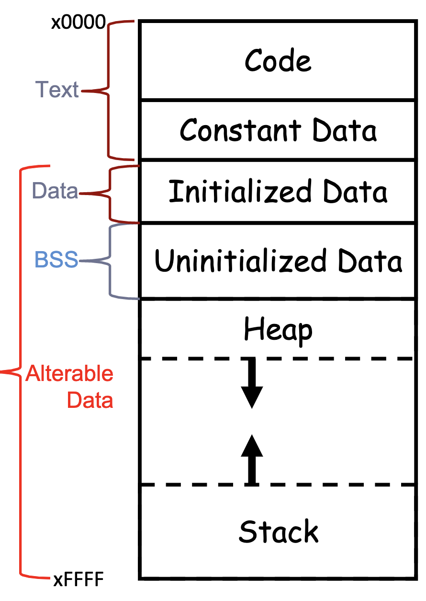
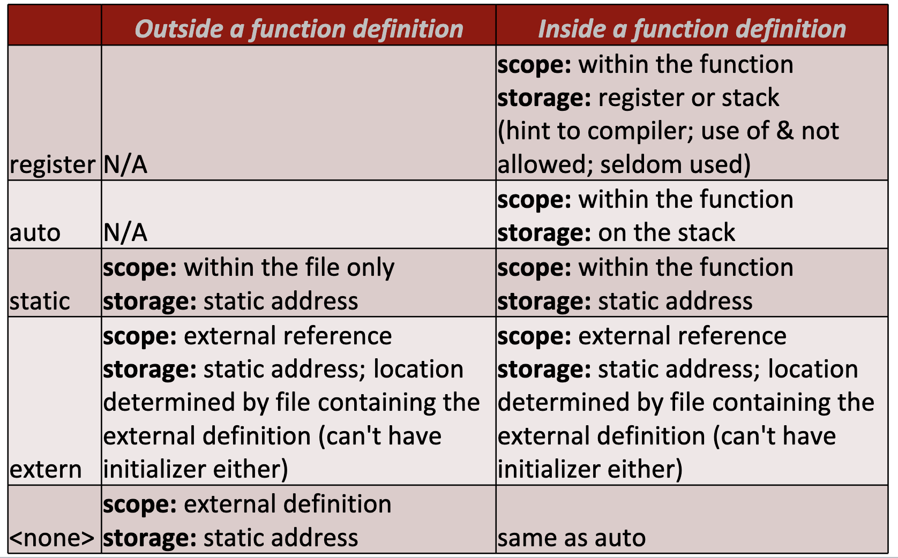
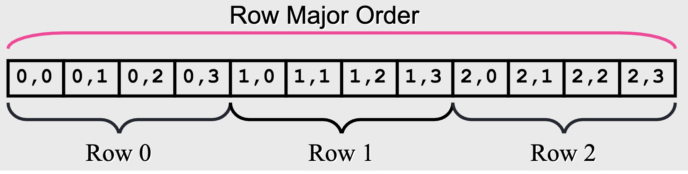

# C Continued
- [C Continued](#c-continued)
    - [Declarations](#declarations)
    - [Scopes](#scopes)
    - [C Types](#c-types)
    - [C Memory Layout](#c-memory-layout)
    - [Storage Class and Type Qualifiers](#storage-class-and-type-qualifiers)
    - [C Declarations: 2 Parts](#c-declarations-2-parts)
    - [Reading and forming Declarations](#reading-and-forming-declarations)
    - [Examples](#examples)
- [Function Calls](#function-calls)
    - [Functions](#functions)
    - [Swapping Integers Example](#swapping-integers-example)
- [Arrays](#arrays)
    - [Differences](#differences)
    - [Multi Dimensional Arrays](#multi-dimensional-arrays)
    - [Element Access](#element-access)
## Declarations
- declaration - introduces an identifier that describes type, object, or function
- definition - instantiates or implements identifier

## Scopes
- File scope - seen by entire file after definition
    - outside function definition
- global scope
    - if no keyword, external definition - has an `extern` somewhere else
    - if `static`, only seen by file
    - if `extern`, seen globally, but declares a reference to external definition somewhere else

```c
file1.c:
    int arr [10];// external definition
    static struct r *p;// this file only
    extern float c[100];// ref to c in file2.c
    ...
file2.c:
    extern int arr[10]; // ref to arr in file1.c
    static struct r *p;// NOT the p above
    float c[100];// definition
    ...
```
## C Types
- strongly typed
    - can do casting
    - c automatically promote/demote within integer types and within floating point types
- type equivalence is determine by struct name, not data structure

## C Memory Layout
- executable code has 3 segments
    - text
        - program code
        - constant data
    - data
        - constant data
        - initialized variables
    - BSS
        - uninitialized static data



## Storage Class and Type Qualifiers
- storage: register, auto, static, extern

- type: part of a type
    - restrict: For the lifetime of a pointer, only the pointer itself or a value directly derived from it may be used to access the object to which it points
    - const: the value of this variable may not be changed within its scope after initialization
    - volatile: the compiler may not optimize references to this variable

## C Declarations: 2 Parts
- base type
    - type, storage class, type qualifier, or typedef
- declarators
    - list of declarators (variables), based on base type

```c
//example
static volatile long int i, *j, k[10];

//base type: long int with type qualifier volatile and storage class static
declarators: i: no modifiers, long int
             j: pointer to, pointer to long int
             k[10]: array[10] of long int
```
## Reading and forming Declarations
- rules:
    - [], (), and * are processed first
- read declarations from inside out

## Examples
```c
int *(**f)()
() = function returning
**f() = function returning a pointer to a pointer
int * = pointer to an int
result: pointer to a pointer to a function returning a pointer to an int
````

# Function Calls

## Functions
- functions must be declared before they are used
- parameters are passed in as value - meaning original reference is not modified - creates a copy

## Swapping Integers Example
```c
void swap(int a, int b){
    int t;
    t = a;
    a = b;
    b = t;
} 
```
- since it is passed as value, only modifies the local variables on the stack during function call, then pops them off - effectively doing nothing
- correct way:

```c
void swap(int *a, int *b){
    int t;
    t = *a;
    *a = *b;
    *b = t;
}
called like this:
int x = 42;
int y = 84;
swap(&x, &y);
```
# Arrays
## Differences
- manual bounds checking needed
- find size of array:
    - `sizeof(arr) / sizeof(arr[0])`
- block of continuous memory storage when declared
- for an array in the heap, can keep both size of array and current number of elements stored in the array
- used in an expression, array name is a constant pointer to the first element stored in the array
    - anything you can do with a pointer, you can do with an array name
- important examples:
```c
these are equivalent:
int *x;
x[5] == *(x+5);


int ia[6];
ia[4] == *(ia + 4 x sizeof(int));
ia == &ia[0]; again, array names are just pointers to the first element
```
## Multi Dimensional Arrays
- declared the same way as java
- how are they stored in memory?
    - row major order


## Element Access
'row * sizeof(row) + column_index * sizeof(arr_type)*'