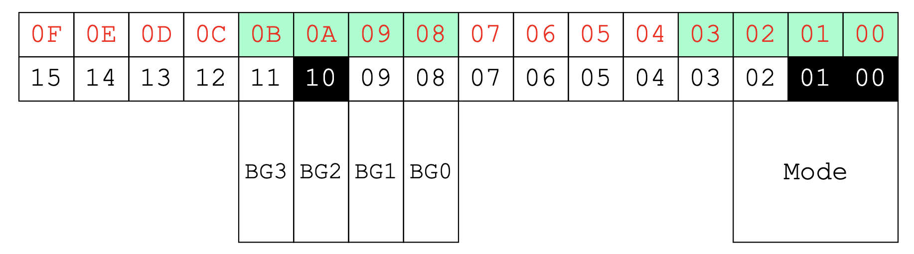

# GBA
- [GBA](#gba)
    - [Processor](#processor)
    - [Input](#input)
    - [Output](#output)
    - [Datatypes](#datatypes)
    - [Device Registers](#device-registers)
    - [REG_DISPCTL](#regdispctl)
- [DMA](#dma)
    - [DMA Channels](#dma-channels)
    - [Using DMA](#using-dma)
!!! note
- look mostly at GBA demo folder for code
## Processor
- ARM RISC processor
- 1 byte char
- 2 byte short
- 4 byte int
- 32 bit address space

## Input
- start
- select
- a
- b
- right, left, up, down
- left shoulder, right shoulder
- one button register 
    - 1 bit/button
    - 0 = pressed, 1 = not pressed

## Output
- 240 x 160 pixel color video display screen
- 6 display modes
    - bit mapped, tiled
- sound effect
- DAC

## Datatypes
- integers
    - char, long, short, unsigned/signed
- floating point
    - float, double

## Device Registers
- register that controls video modes: `REG_DISPCTL is at 0x0400 0000`
    - in order to touch , `*(unsigned short *)0x04000000`
    - `#define REG_DISPCTL (*(unsigned short *)0x04000000)`

## REG_DISPCTL

- Bits 0-2 Mode
    - 0,1,2 tile mode
    - 3,4,5 bitmap mode

# DMA
!!! note to see code implementation, look at `DMA.h` in `GBAdemo`
- direct memory access
- hardware supported data copy
    - up to 10x as fast as array copies
    - set up, CPU is halted, data is transferred, and CPU takes back control

## DMA Channels
- skip 0, 1, 2 channels
- only use 3rd channel
    - used for general purpose copies

## Using DMA
- source memory address: REG_DMAxSAD (x = 0, 1, 2, 3)
    - location of data that will be copied
        - typically an image or color
    - treated like a 32 bit register
- destination memory address: REG_DMAxDAD
    - where to copy data to
        - almost always just video buffer
- controller: how much to copy
    - REG_DMAxCNT
    - defines behavior of dma controller
        - on/off, how many elements to copy over, how to iterate through destination, how to iterate over the source